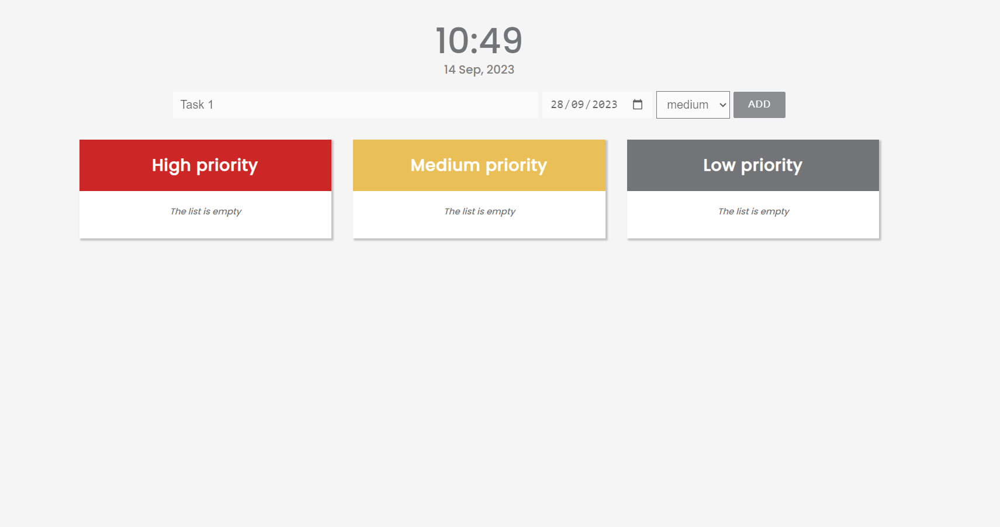
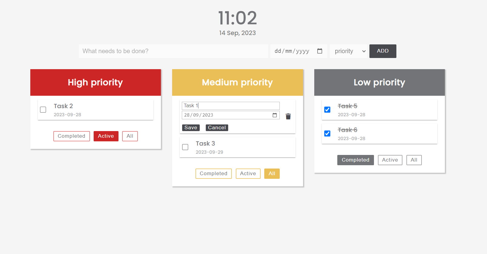

# Todo App

The Todo App is a flexible task organizer that helps users manage their tasks. It includes a real-time clock and allows to categorize tasks into three levels of importance: high, medium, and low. This app is built using JavaScript and offers following useful features:

## Features

- **Task Management:** Create, update, delete tasks and toggle completion status.

- **Due Dates:** Add due dates to tasks for efficient deadline tracking.

- **Task Prioritization:** Utilize drag-and-drop functionality to change task priority levels between high, medium, and low.

- **Edit/Delete Tasks:** Hover over a task to reveal icons for editing task details and dates or deleting task.

- **Task Completion:** Mark tasks as completed or active using checkboxes.

- **Task Filters:** Use filter buttons (completed, active, all) to sort tasks based on their completion status.

- **Local Storage:** All task data is stored in the browser's local storage.

- **Real-Time Clock:** View the current time, date, and day of the week within the app.

## Tech Stack

- JavaScript
- HTML/CSS
- Font awesome

## Access the App

You can access the application at the following link: [Todo App](https://nataly-horbunova.github.io/todo_list/)

## Screenshots

_Empty Task Lists_

_Editing Task_
